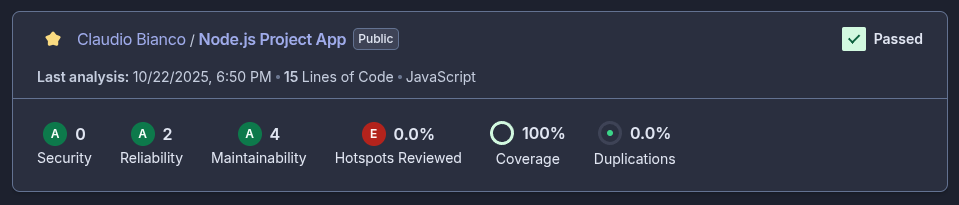

# 🧩 Node.js API – Exemplo com Express, Jest, Docker e SonarCloud

Aplicação simples em **Node.js 18 + Express**, com rotas básicas, testes unitários em **Jest**, integração CI/CD via **GitHub Actions**, análise estática e cobertura de código com **SonarCloud**, e execução conteinerizada com **Docker**.

* * *

## 📂 Estrutura do projeto

```
.
├── src/
│   ├── app.js          # Lógica principal (rotas e handlers)
│   └── server.js       # Ponto de entrada da aplicação
│
├── __tests__/          # Testes unitários Jest
│   └── index.test.js
│
├── package.json
├── jest.config.js
├── Dockerfile
├── .dockerignore
├── sonar-project.properties
└── README.md
```

* * *

## 🚀 Tecnologias utilizadas

| Tecnologia | Descrição |
| --- | --- |
| **Node.js 18** | Ambiente de execução JavaScript |
| **Express** | Framework minimalista para criação de APIs |
| **Jest** | Testes unitários e cobertura de código |
| **Supertest** | Testes de integração HTTP |
| **Docker** | Containerização da aplicação |
| **SonarCloud** | Análise de qualidade e cobertura de código |
| **GitHub Actions** | CI/CD pipeline automatizado |

* * *

## ⚙️ Instalação e execução local

### 1. Clonar o repositório

```bash
git clone https://github.com/seu-usuario/nodejs-app.git
cd nodejs-app
```

### 2. Instalar dependências

```bash
npm ci
```

> Use `npm ci` em vez de `npm install` para builds reprodutíveis (ideal para CI/CD).

### 3. Executar em modo desenvolvimento

```bash
npm start
```

A aplicação estará disponível em:  
👉 [http://localhost:3000](http://localhost:3000)

* * *

## 🧭 Endpoints disponíveis

| Método | Rota | Descrição | Exemplo |
| --- | --- | --- | --- |
| `GET` | `/` | Retorna “Hello World!” | `GET /` |
| `GET` | `/sum/:a/:b` | Soma dois números inteiros | `GET /sum/10/5` → `15` |

* * *

## 🧪 Testes automatizados

Executa todos os testes unitários e gera o relatório de cobertura:

```bash
npm test -- --coverage
```

Exemplo de saída:

```
PASS __tests__/index.test.js
  API básica
    ✓ GET / retorna 200
    ✓ GET /sum/:a/:b soma corretamente
----------|---------|----------|---------|---------|-------------------
File      | % Stmts | % Branch | % Funcs | % Lines | Uncovered Line #s
----------|---------|----------|---------|---------|-------------------
All files |   88.88 |      100 |   66.66 |   88.88 | 14
```

Relatório detalhado em HTML:

```
coverage/lcov-report/index.html
```

### 📊 Sonarcloud



* * *

## 🐳 Executar com Docker

### 1. Build da imagem

```bash
docker build -t nodejs-app .
```

### 2. Rodar o container

```bash
docker run --rm -p 3000:3000 nodejs-app
```

Acesse:  
👉 [http://localhost:3000](http://localhost:3000)

### 3. Rodar com variável de ambiente (simulação de cobertura reduzida)

```bash
docker run -e REDUCE_COVERAGE=true -p 3000:3000 nodejs-app
```

* * *

## ☁️ Integração com GitHub Actions + SonarCloud

O repositório está configurado com CI/CD automatizado:

### 📋 `.github/workflows/ci.yml` (resumo)

```yaml
- uses: actions/checkout@v4
- uses: actions/setup-node@v4
  with:
    node-version: 18
    cache: 'npm'
- run: npm ci
- run: npm test -- --coverage
- uses: SonarSource/sonarcloud-github-action@v2
  env:
    SONAR_TOKEN: ${{ secrets.SONAR_TOKEN }}
```

### 🔐 Secrets necessárias

* `SONAR_TOKEN` → token gerado no SonarCloud para autenticação.
    

* * *

## 📊 Configuração do SonarCloud

Arquivo `sonar-project.properties`:

```properties
sonar.projectKey=seu-org_nodejs-app
sonar.organization=seu-org
sonar.projectName=nodejs-app
sonar.sources=src
sonar.tests=__tests__
sonar.test.inclusions=**/__tests__/**/*.test.js
sonar.javascript.lcov.reportPaths=coverage/lcov.info
sonar.exclusions=**/__tests__/**,**/*.config.js,jest.config.js,coverage/**,node_modules/**,**/*.yml,**/*.yaml
```

* * *

## 🧱 Dockerfile simplificado

```dockerfile
FROM node:18-alpine
WORKDIR /app
COPY package*.json ./
RUN npm ci --only=production
COPY src ./src
USER node
EXPOSE 3000
CMD ["node", "src/server.js"]
```

* * *

## 🧰 Comandos úteis

| Ação | Comando |
| --- | --- |
| Rodar app localmente | `npm start` |
| Rodar testes com cobertura | `npm test -- --coverage` |
| Build Docker | `docker build -t nodejs-app .` |
| Rodar Docker | `docker run -p 3000:3000 nodejs-app` |

* * *

## 🧑‍💻 Autor

**Cláudio Martin Bianco**  
💼 DevOps / Platform Engineer  
🌐 [GitHub](https://github.com/seu-usuario) | [LinkedIn](https://linkedin.com/in/seu-perfil)

* * *

## 📝 Licença

Este projeto está licenciado sob a licença **MIT**.  
Sinta-se livre para usar, modificar e distribuir conforme necessário.

* * *